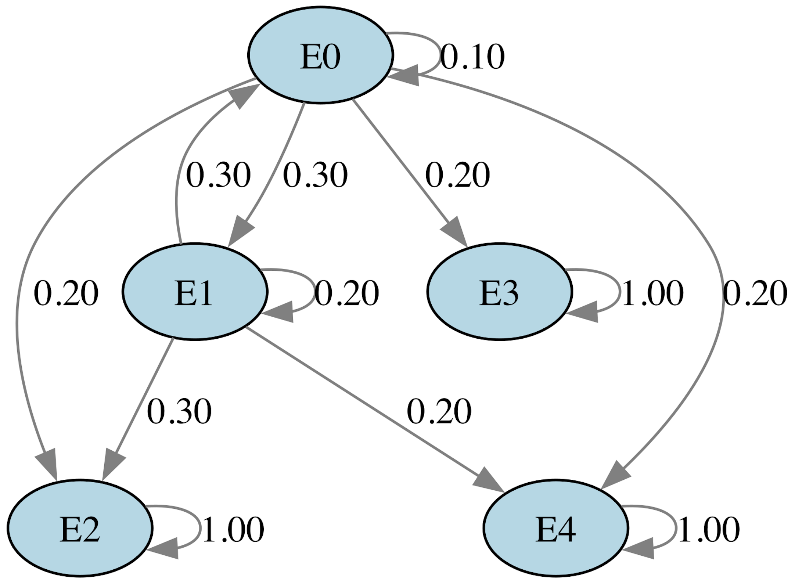

<div align="center">

# Markov Chain diagrams: cost allocation and state transition analysis

</div>

This repository provides Python scripts to create visual diagrams representing state transitions in Markov chains. Using the `pydot` library, these scripts define states, assign transition probabilities, and generate SVG diagrams to visualize the flows between transient and absorbing states in various scenarios.

## Objective

This repository is designed to facilitate Markov chain applications in scenarios that require easy-to-read, scalable visual outputs for analysis and reporting.

## Overview

This approach is useful for visualizing transition flows in systems with transient and absorbing states, such as in departmental cost allocations and service tier classifications.

## Key Features

- **Customizable Transitions:** The code is easily adaptable for different applications requiring Markov chain-based visualizations and analyses.
- **State and Transition Definitions:** Includes transition matrices for various scenarios, such as departmental costs moving from Accounting and Consulting to Production Divisions, and transitions between service levels.
- **SVG Graph Generation:** Diagrams are saved in SVG (Scalable Vector Graphics) format, a flexible, resolution-independent format. This ensures that users can scale the diagrams to any size without quality loss, making them ideal for embedding in reports, presentations, posters, or other documents where precise visuals are essential.

## Requirements

Ensure that you have `pydot` and `matplotlib` installed to use the scripts in this repository. You can install `pydot` using `pip`:
```bash
pip install pydot matplotlib
```


## Example Diagrams

Below is an example of a generated state transition diagram that helps to demonstrate how transitions between states can be visualized, supporting analyses in various Markov chain applications.

<div align="center">
    
</div>


